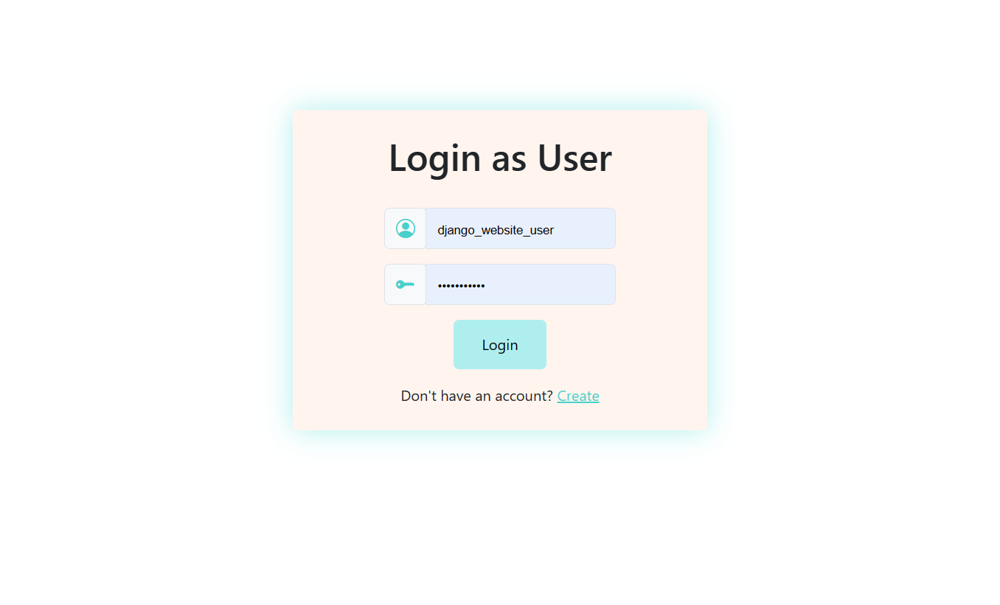
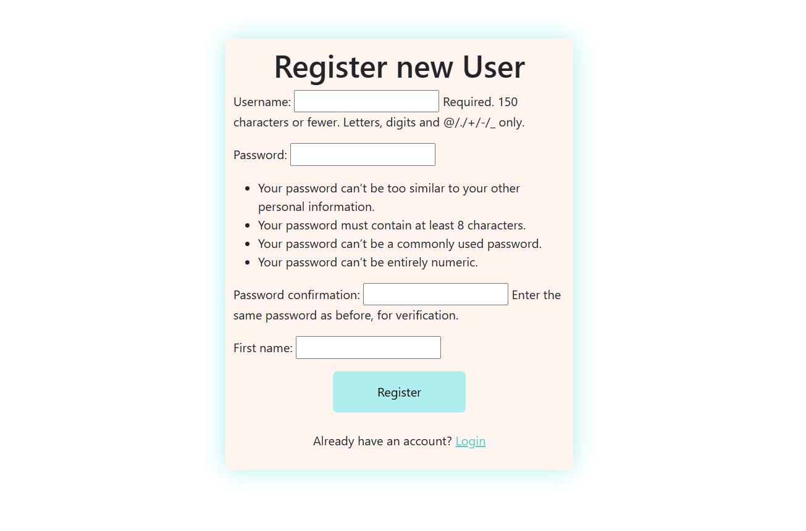

# Project name
Cold Meats

# Project description
*importance of your project, and what it does*
+ Create a Django application that can be used by the business Cold Meats and its clientelle. The program should allow the user to:
    + register a new user
    + login a user    
    + view the catalogue of cold meats
    + contact the business to place an order
	+ add new blog posts
	+ view all blog posts
    + subscribe to the blog 
	+ vote on polls relevant to the business
	
+ Create a database for the blog posts and polls
+ Add blog entries
+ Add polls and choices for each poll

# Installation section
*tell other users how to install your project locally*
Outline the steps necessary to build and run your application with venv and Docker:
Create a Virtual Environment:
1. Open the Command Prompt
1. Create a Virtual Environment:
    + in Command Prompt (powershell)
    + create a folder for new virtual env: mkdir Virtual_env
    + cd Virtual_env
    + create virtual env: virtualenv my_django
    + you will see Scripts in my_django
    + change to Command Prompt (admin) 
    + python -m venv my_django
1. Activate the Virtual Environment:
    + On Windows (Command Prompt):
        + cd to path to Scripts "C:\Users\kisha\Dropbox\KC22070003466\3 - Advanced Software Engineering\L3T10 - Capstone Project - Consolidation\Capstone_Project\Virtual_env\my_django\Scripts"
        + activate.bat
   
1. Download Python to run the program @ https://www.python.org/downloads/

1. Install Packages:
    + pip install [package_name]

The docker image can be found at: 
+ https://hub.docker.com/repository/docker/kcse1/django-app/general

Outline the steps necessary to build and run your application with venv and Docker:
+ Install Docker desktop @ https://www.docker.com/products/docker-desktop
+ Open the Command Prompt
    Follow the commands:
    + docker run hello-world
    + docker build -t django-app . (Notice the '/' left off at the end)    
    + docker run -d -p 80:80 django-app    
    + docker tag django-app [user]]/[repo]]
    + docker login
    + docker push [user]]/[repo]]
    + docker run -d -p 80:80 [user]]/[repo]]

1. Deactivate the Virtual Environment:
    + deactivate

# Usage section
*instructs others on how to use your project after they’ve installed it.*
*Include screenshots of your project in action*
In the Command Prompt:
+ cd to project root directory and run the command: python manage.py runserver
+ *Note: Django Secret Key and Database Admin login is in the secret.txt in the Dropbox*

# Credits
*highlights and links to the authors of your project if the project has been created by more than one person*
@KC-software-en

# Add a URL to your GitHub repository

https://github.com/KC-software-en/L3T10-repo
